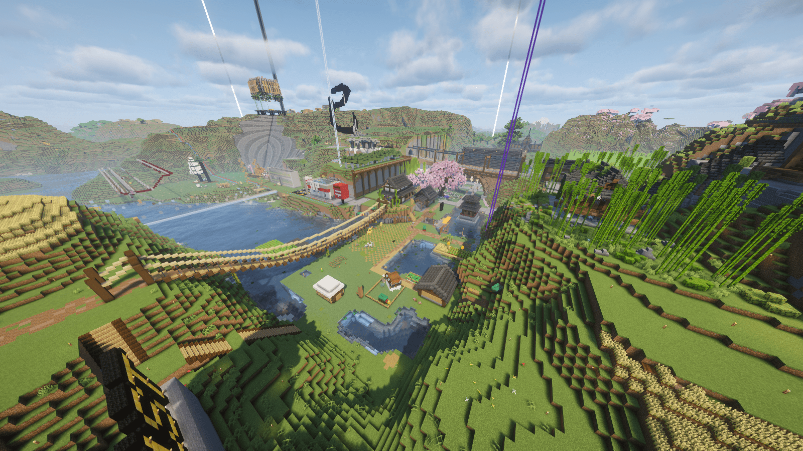

# ようこそ えと鯖 Wiki へ！

## えと鯖とは？

えとわすサーバー（通称：えと鯖）は、2024年2月17日に開設された基本サバイバルの Minecraft Java Edition マルチサーバーです。
サーバーは24時間稼働しています。
バニラ互換のため、クライアント側に特別な Mod を導入する必要なく参加できます。
現在(2025/10/04)のバージョンは`1.21.8`です。

### ゲームモード
サバイバルの難易度は`ハード`です。
空腹時は死亡するまで体力が減少し続けるため注意して下さい。

プレイヤー同士の PvP は無効化されていて他プレイヤーを攻撃することはできません。

### 夜
サーバー内の**誰か一人が寝ることで夜をスキップ**できます。
朝を迎えるために全員が寝る必要はありません。
夜間に活動したい場合は、前もってほかのプレイヤーにベッドで寝ないで欲しいとを伝えておきましょう。

### ワールド
えと鯖には以下のワールドがあります。

- **メインワールド**: サバイバルワールド。このワールドを中心に活動します。
- **クリエイティブワールド**: クリエイティブモードで試作などができるワールドです。WorldEdit が使用可能です。

メインワールドとクリエイティブワールドはスポーン地点近くの岩盤ゲートで行き来できます。
なお、各ワールドごとにインベントリは独立しています。

## 配信について

えと鯖での配信は自由です。
Twitch や YouTube などでの配信を歓迎します。
ただし、新たに配信を始める場合は事前に鯖主にお知らせください。（認知しておきたいので）

また、サーバーで遊ぶ際は**誰かが配信している可能性がある**ことを念頭に置いてください。
特にチャットでの発言には注意しましょう。

## Discord サーバー
えと鯖には公式 Discord サーバーがあります。
サーバーに参加するには、[こちらのリンク](https://discord.gg/TuTwKNjWum)から参加してください。

## バックアップ

えと鯖のバックアップは、毎週水曜日の正午に自動で実行されます。
バックアップ時間中はサーバーに接続できません。
なお、サーバーの稼働情報は Discord の [#minecraft-sync](https://discord.com/channels/1128971828644294666/1208420765716717629) チャンネルで確認できます。
バックアップデータは鯖主が管理しており、プレイヤーが直接アクセスすることはできません。

## Wiki について
この Wiki はえと鯖の情報をまとめたものです。
サーバー内のルールや施設の使い方、よくある質問などを掲載しています。
Wiki の編集を希望する場合は、鯖主にご連絡ください。
また、Wiki の内容に誤りや不明点がある場合も鯖主にお知らせください。